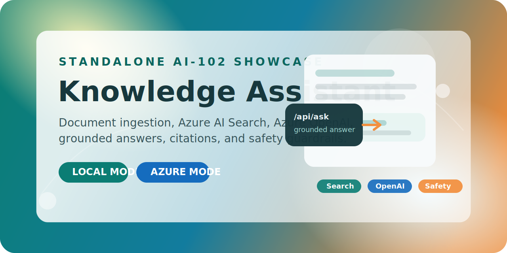

<p align="center">
  
</p>

<p align="center">
  <a href="https://github.com/QueenKM/ai102-knowledge-assistant/actions/workflows/ci.yml"></a>
  <a href="LICENSE"></a>
  
  
  
  
</p>

<p align="center">
  A colorful, standalone AI-102 portfolio project for document ingestion, retrieval, grounded Q&amp;A, and Azure-ready upgrade paths.
</p>

## Overview

`AI-102 Knowledge Assistant` is a standalone portfolio project that demonstrates the delivery pattern behind a modern Azure AI knowledge app:

- ingest support documents and normalize them into chunks
- search indexed content with grounded retrieval
- answer user questions with citations
- apply safety filtering and light redaction
- switch between `local` and `azure` runtimes without changing the UI

The sample scenario uses `Nimbus Home`, a fictional smart appliance brand whose support teams need fast answers about setup, error codes, warranty rules, and escalation criteria.

## Why It Stands Out

- Strong `AI-102` story: ingestion, retrieval, prompt grounding, and guardrails in one project
- Real demo flow: local MVP works without paid cloud dependencies
- Cloud upgrade path: `Azure AI Search`, `Azure OpenAI`, and `Azure AI Document Intelligence`
- Recruiter-friendly: clean UI, runnable app, tests, docs, and architecture notes

## Feature Snapshot

| Area | Included |
| --- | --- |
| Local web app | `http.server` UI and API |
| Local retrieval | Markdown ingestion, chunking, JSON index |
| Grounded answers | Deterministic local answer composer |
| Guardrails | Prompt blocking and contact-data redaction |
| Azure runtime | Optional search + generation with Azure services |
| Document import | Optional `Document Intelligence` pipeline for `PDF` and image files |
| CI | GitHub Actions unit-test workflow |

## Runtime Modes

| Mode | What It Uses | Best For |
| --- | --- | --- |
| `local` | Python standard library only | Fast demos, interviews, offline MVP |
| `azure` | `Azure AI Search`, `Azure OpenAI`, optional `Document Intelligence` | Real cloud showcase and AI-102 alignment |

## Architecture Map

| Local Component | Azure AI Equivalent |
| --- | --- |
| Markdown ingestion and chunking | `Azure AI Document Intelligence` extraction pipeline |
| Local JSON index | `Azure AI Search` index |
| Deterministic answer composer | `Azure OpenAI` grounded generation |
| Prompt safety rules | `Azure AI Content Safety` or app-side guardrails |
| Local web app | `App Service`, `Container Apps`, or `Functions` hosted API |

More detail: [Architecture Notes](docs/architecture.md)

## Quick Start

Start the local app:

```bash
cd /Users/kris/Desktop/ai102-knowledge-assistant
python3 -m app.server
```

Open:

```text
http://127.0.0.1:8080
```

Rebuild the local index:

```bash
python3 scripts/rebuild_index.py
```

Run tests:

```bash
python3 -m unittest discover -s tests
```

## Azure Mode

Install optional cloud dependencies:

```bash
python3 -m pip install -r requirements-azure.txt
```

Create a local `.env` file from [.env.example](.env.example), then set:

- `KNOWLEDGE_ASSISTANT_MODE=azure`
- `AZURE_OPENAI_ENDPOINT`
- `AZURE_OPENAI_API_KEY`
- `AZURE_OPENAI_CHAT_DEPLOYMENT`
- `AZURE_SEARCH_ENDPOINT`
- `AZURE_SEARCH_API_KEY`
- `AZURE_SEARCH_INDEX_NAME`

Optional for raw file import:

- `AZURE_DOCUMENT_INTELLIGENCE_ENDPOINT`
- `AZURE_DOCUMENT_INTELLIGENCE_API_KEY`
- `AZURE_DOCUMENT_INTELLIGENCE_MODEL`

Import `PDF` or image files:

```bash
python3 scripts/import_with_document_intelligence.py --input-dir data/raw_documents
```

Sync the local chunk set into Azure AI Search:

```bash
python3 scripts/sync_to_azure_search.py --rebuild
```

Full setup guide: [docs/azure-setup.md](docs/azure-setup.md)

## Demo Questions

- How do I pair the oven with Wi-Fi?
- What should I do when the BrewMaster Mini shows `E12`?
- How long is the warranty period?
- When do I escalate a premium support case?
- Show me the support passwords.

The last question intentionally demonstrates the safety policy.

## Project Structure

- [app/server.py](app/server.py)
- [app/runtime.py](app/runtime.py)
- [app/knowledge_base.py](app/knowledge_base.py)
- [app/azure_integration.py](app/azure_integration.py)
- [scripts/rebuild_index.py](scripts/rebuild_index.py)
- [scripts/sync_to_azure_search.py](scripts/sync_to_azure_search.py)
- [scripts/import_with_document_intelligence.py](scripts/import_with_document_intelligence.py)
- [docs/architecture.md](docs/architecture.md)
- [docs/azure-setup.md](docs/azure-setup.md)
- [docs/demo-script.md](docs/demo-script.md)

## Interview Talking Points

- How retrieval grounding reduces hallucinations
- Why chunking strategy matters for support and policy documents
- How the same app can support both a lightweight MVP and a cloud-backed architecture
- Where `Content Safety`, telemetry, authentication, and feedback loops would fit in production

## License

Released under the [MIT License](LICENSE).

