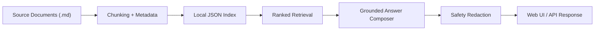

# Architecture Notes

## Solution Intent

This project demonstrates the delivery pattern behind a practical `AI-102` style solution:

1. ingest source documents
2. extract clean text and metadata
3. build a searchable index
4. answer questions with grounded citations
5. apply safety controls before returning output

## Local MVP Flow

## Azure AI Mapping

| Stage | Local MVP | Azure Upgrade |
| --- | --- | --- |
| Ingestion | Markdown file reader | `Azure Blob Storage` trigger or upload pipeline |
| Text extraction | Plain text input | `Azure AI Document Intelligence` for PDFs and scans |
| Indexing | `index.json` | `Azure AI Search` index with metadata filters |
| Retrieval | local term scoring | hybrid or semantic retrieval in `Azure AI Search` |
| Answering | deterministic composition | `Azure OpenAI` with retrieved grounding |
| Safety | prompt blocklist and redaction | `Azure AI Content Safety` and app rules |
| Hosting | local `http.server` | `Azure App Service`, `Container Apps`, or `Functions` |

## Suggested Azure Components

- `Azure AI Search` for indexed chunks and citations
- `Azure AI Document Intelligence` for OCR and layout extraction
- `Azure OpenAI` for grounded answer generation
- `Azure Storage` for uploaded raw files
- `Application Insights` for query telemetry
- `Managed Identity` and `Key Vault` for secrets handling

## Interview Talking Points

- Why chunking strategy matters for answer quality
- How to preserve citations and avoid hallucinated answers
- Why safety filtering happens before and after retrieval
- How to separate a local MVP from a cloud production architecture
- How to add monitoring, feedback loops, and security controls

